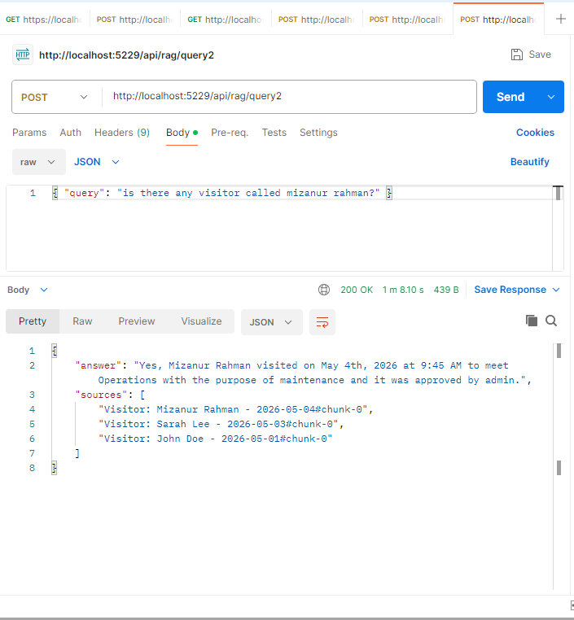
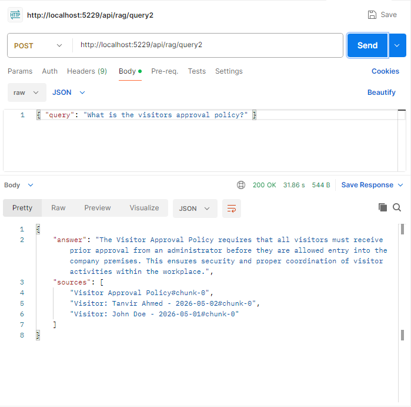
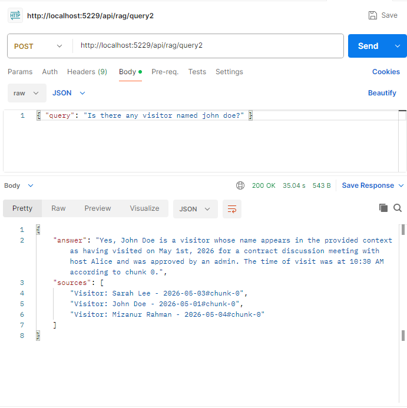
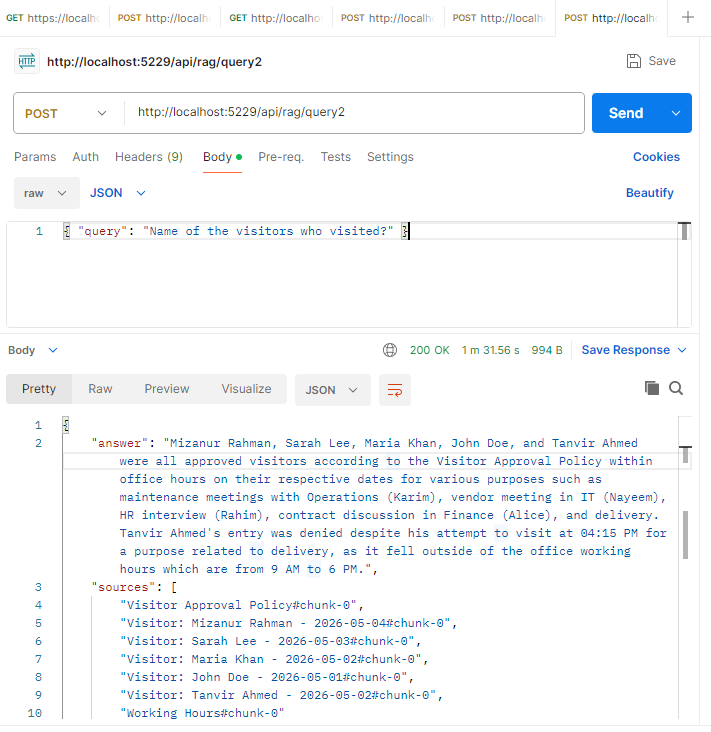

# RagKnowledgeAssistant

[](https://dotnet.microsoft.com/download/dotnet/8.0)
[](https://ollama.com/)

A high-performance, privacy-centric Retrieval-Augmented Generation (RAG) system built with **ASP.NET Core 8** and **Local LLMs**. This project demonstrates a production-grade transition from basic lexical search to advanced semantic retrieval using local vector embeddings and grounded response generation.

---

## 🚀 Overview

**RagKnowledgeAssistant** provides an intelligent interface over company knowledge bases (Policies & Visitor Logs). Unlike traditional search, it understands the intent behind queries and generates context-aware answers using a local LLM, ensuring that sensitive data never leaves your infrastructure.

### Key Capabilities
- **Local-First Architecture**: Powered by [Ollama](https://ollama.com/), running models locally (no OpenAI/Azure dependencies).
- **Hybrid Search**: Combines **Vector Similarity (Cosine)** with **Lexical Scoring** for pinpoint accuracy.
- **Phase-Based Evolution**: Clearly separated implementations for Lexical MVP (Phase 1) and Semantic RAG (Phase 2).
- **Extensible Pipeline**: Layered services for Document Loading, Chunking, Embedding, and Vector Storage.

---

## 🏗️ Architecture

The system is designed with a clean, decoupled architecture following SOLID principles.

### Phase 1: Lexical Retrieval (MVP)
*   **Method**: Keyword-based scoring on titles and content.
*   **Use Case**: Fast, deterministic search for exact matches.
*   **Flow**: `Query` -> `Retriever` -> `Context Builder` -> `Templated Response`.

### Phase 2: Semantic RAG (Advanced)
*   **Method**: Vector embeddings + LLM Generation.
*   **Models**: `nomic-embed-text` (Embeddings) & `phi3:mini` (LLM).
*   **Flow**: `Query` -> `Vector Search` -> `Context Augmentation` -> `LLM Grounded Answer`.

> [!TIP]
> For a deep dive into the service layers and data flow, refer to the [Architecture Documentation](Docs/architecture.md).

---

## 🛠️ Getting Started (Run from Scratch)

Follow these steps to set up the environment and run the project locally.

### 1. Prerequisites
- **.NET 8.0 SDK**
- **Ollama** (Download from [ollama.com](https://ollama.com/))
- At least **8GB RAM** recommended for `phi3:mini`.

### 2. Prepare Local Models
Open your terminal and pull the required models via Ollama:

```bash
# Pull the embedding model (Phase 2)
ollama pull nomic-embed-text

# Pull the lightweight LLM (Phase 2)
ollama pull phi3:mini
```

Ensure the Ollama server is running (usually at `http://localhost:11434`).

### 3. Clone and Build
```bash
git clone https://github.com/your-repo/RagKnowledgeAssistant.git
cd RagKnowledgeAssistant
dotnet build
```

### 4. Configuration
Environment variables are used to configure Ollama connectivity. Defaults are provided in `appsettings.json` or can be set manually:

| Variable | Default |
| :--- | :--- |
| `OLLAMA_BASE_URL` | `http://localhost:11434` |
| `OLLAMA_EMBED_MODEL` | `nomic-embed-text` |
| `OLLAMA_GEN_MODEL` | `phi3:mini` |

### 5. Run the Application
```bash
dotnet run --project RagKnowledgeAssistant.csproj
```
The API will start at `http://localhost:5229` (check `Properties/launchSettings.json`).

---

## 🧪 API Usage & Examples

### Phase 2: Semantic Query
**Endpoint**: `POST /api/rag/query2`

#### Example Request:
```json
{
  "query": "Who visited the office and what was the reason for John Doe's visit?"
}
```

#### Example Response:
```json
{
  "answer": "John Doe visited the office for a project meeting. Other visitors include...",
  "sources": ["Visitor Logs - 2024-05-10", "Visitor Policy"]
}
```

---

## 📸 System in Action

Below are demonstrations of the RAG system handling various queries with grounded context.

### Semantic Retrieval Examples

| Scenario | Screenshot |
| :--- | :--- |
| **Basic Query** |  |
| **Policy Details (Working Hours)** |  |
| **Visitor Approval Logic** |  |
| **Specific Entity Search** |  |
| **Complex Aggregation** |  |

---

## 🗺️ Roadmap & Future Enhancements
- [ ] **Persistent Vector DB**: Integration with Qdrant or Milvus for scaling.
- [ ] **Streaming Responses**: Real-time LLM token streaming.
- [ ] **Advanced Chunking**: Recursive character or semantic chunking.
- [ ] **Multi-Modal Support**: Analyzing PDF/Image-based policy documents.

---

## 🤝 Contributing
Contributions are welcome! Please ensure you follow the existing service-oriented pattern and include unit tests for new retrieval logic.
